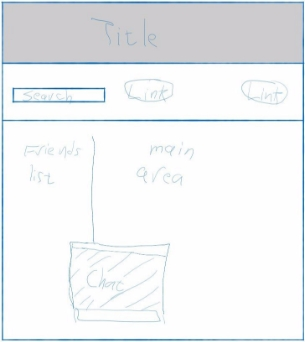
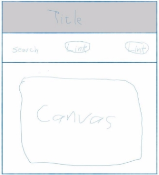
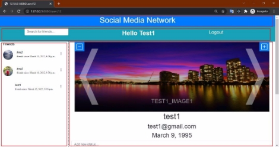

**Introduction** 

This project was done as a final coursework assignment for CM3035 Advanced Web Development course for Goldsmith, University of London as part of their Bachelor of Computer Science program. The project task is to implement a social network web application. The main requirement for the application is that it should be able to: 

- Allow users to create new password secured accounts. 
- Collect and store an appropriate amount of information about each user (e.g., username, use picture). 
- Give each user a “home” page that shows their user information and any other interesting data such as images, picture galleries or other media files. And displays user status updates. These home pages should be discoverable and visible to other users 
- Allow users to post status updates to their “home” page. 
- Allow users to search for other users and “add” them to their network of contacts or friends. 
- Allow users to view a list of their friends. 
- Allow users to use a portion of the application that makes use of real time communication by using web sockets. Some examples may be real-time chat between friends, a basic computer game or media/audio streaming. 
- Use an appropriate REST interface for User data. 
- Make appropriate use of Web Sockets 

**Design** 

**Basic Visual** 

The first thing that came to my mind when thinking of a social media network is Facebook, so my design is based on the basic design of Facebook. I think this would make the application more user friendly and intuitive especially that I do not have enough time to work on the design and make it as clear and user friendly as much as possible. So, I decided to have a one-page web app with the title of the app on top, together with general links and a search bar to search for other users. The remaining part of the page is divided into two parts side by side, a smaller part that shows the friends list, and a bigger part that shows the user data (images, posts, details). The chats are going to be through a pop-up box, and when a functionality would require some space or a form, then I can implement it through a relative pop-up canvas. So, my basic idea is as follows:  

**Database Basic design:** 

For this application we would need a database to store the application data. The data we would need to store are users’ data, which includes their personal information, their published posts, their images, and the users they are friends with. For this I decided to have a table for users which include their name, date of birth, email, and password for their accounts. Another table for images that would include the image, a thumbnail copy, and a name for that image. And another table for posts including the posts texts, date of creation and last date of modification. Finally, a table to store chats data. Then I would need to create relationships between these entities. First, between the users and images tables, each user can have multiple images, while each image is only owned by one user, so it is going to be a one-to-many relationship. A similar relationship is also going to be implemented between users and posts tables. There should also be a relationship between different users, as each user can have multiple friends, so this is going to be a many to many relationships, and to better implement it I would create a new table for this relationship, and as chats is going to be something between friends only, so I decided not to implement the chats table, and add chats as a property in the friends’ relationship table. 

**Project Process** 

**General** 

The project is created using python and Django. So, I created setup python and Django, and created a new Django project called “socialnetwork”. Inside the project, I created a new app called “socialmedia”. This is where my application would be implemented. Inside the app directory I created templates/socialmedia/ directory to store the html files. I also created static directory with CSS and js directories inside to store CSS and JavaScript files respectively. Then I edited the main project settings to include the “socialmedia” app and the static and images paths:  

Then I edited the URLs of the project to include the app URLs and the images directory: 

**Database** 

Then I started by creating the database. I am going to use Django models and SQLite for this. So, I edited the project settings to include SQLite, database configurations, and add a list of the allowed hosts to use the database.  

Then I implemented the database inside the models file of the app. For simplicity, I am going to use Django already available User model, but to add extra fields to it, I created a new model called AppUser that has a one-to-one field to Django User model, a birth date field that has a default value if not provided of Jan 1st, 1970, and a many to many field that is going to be connected the friends relationship model. 

Second, I created the image model with fields of: 

- Name: contains a name for the image 
- Image: contains the image file 
- Thumbnail: contains a thumbnail copy of the image 
- User: foreign key to the AppUser model 

Third, the status model with fields of: 

- Status: contains the post text 
- Date: contains the post creation date 
- LastDate: contains the post last modification date 
- User: foreign key to the AppUser model 

Lastly, the UserUserFriend (friends’ relationship) model with fields of: 

- User1: foreign key to the AppUser model 
- User2: foreign key to the AppUser model 
- Date: contains the date when they became friends 
- Chat: contains the text of the chat between the two users 

Then, for simplicity I added a method to the AppUser model to iterate through the UserUserFriend model and return a list of the user friends, the method is called getFriend() 

Then, to create the database and establish the models I ran the python migrations “python manage.py makemigrations” “python manage.py migrate” 

**Image thumbnail/Celery** 

After that I needed a method to create a thumbnail of any added image to the database. For that I am going to implement celery with Redis server so that the thumbnail creation process is done in parallel to the app normal process, for better performance and user experience. So, I installed the following relative modules: “pip install celery[Redis] Redis Pillow”. Then to configure celery to work with the project and Redis properly, I created a celery.py file inside the project directory, and added the proper configurations.  

So, now to start celery I just have to run it from the terminal inside the project directory and pass it the app name to receive tasks from it. I ran onto some problems at first when I tried to run celery, it was receiving tasks but do not execute them, I looked the problem online and got a solution by adding extra parameters, I do not understand completely, as celery seems like a big topic, and I did not have enough time to get to understand, so the final code to run celery is as follows: 

celery --app=socialnetwork.celery:app worker -- loglevel=INFO --pidfile=celery.pid --without-gossip -- without-mingle --without-heartbeat -Ofair --pool=solo 

And as celery uses Redis server, I looked up the easiest way to run Redis server on windows platform as I am working on a windows operated PC, and I came up with Memurai which after installing and configuring, just runs Redis server as a service in the background, so I do not have to run the Redis server each time. 

Then I created the function that creates the thumbnail copy of the image, which is added to celery queue of tasks. I created the function in a new file called tasks.py. The function is called “make\_thumbnail” and is passed the id of the relative image in the database. 

 

Then, the function accesses the image model and retrieves the corresponding image.  

Then, it looks for that image in the images directory and scales the width down to 100 pixels and the height with the relative ratio to keep the aspect ratio between the width and height constant. Then save the new image. 

Then, the function creates a copy of the newly generated imaged that is compatible with Django models and saves it in the images directory. 

Then, the new thumbnail is added to the image record in the database. 

Then, I updated the save method of the image model in the models.py, to run make\_thumbnail function after saving a new image. 

**Admin Interface** 

After that, to simplify my work with the database, I implemented Django admin model. So, I created a new file admin.py inside the app directory, inside the file I created a class for each model in the database and specified which fields to be visible, which are editable, and which are not if they are created automatically such as the date fields. 

For the image model admin implementation, I edited the get\_form method to make the thumbnail field not required as it will not be provided unless after the original image is added to database.  

Then, I wanted to be able to view the image in the admin interface, so I added an extra field for the image model called “image\_tag” which is not editable. 

Then, in the image model in models.py I created a new method that specifies what to return when an image\_tag field is called. The method is called “image\_tag()” and returns an img html element with the image to view it. 

**API implementation** 

Then to fulfill the REST requirement of the application, I worked on creating API endpoints to show the data of the database. I did that by using Django rest framework, so I started by installing the relevant module  

“pip install djangorestframework”, then to be able to use it, I added it to the list of applications in the project settings. 

Then, I created a serializers.py file inside the app directory, that uses the serializer class of Django rest framework to validate data for each model. So, for each model, I created a serializer class that specifies which data should be returned by the API for that model.  

Then I created an api.py file that includes classes that uses the app models, serializers, and Django rest-framework mixins and generics to create the views and construct the endpoints of the API. So, I created a class for each of user, image and status that return the data of the item requested by passing its id in the URL.  

Also, for each of them I created an extra class that returns a list of all data in each model. 

I also edited the perform\_create method of the image API to run the make\_thumbnail function after adding a new image. 

Then, I edited the url.py file to include the API endpoints and point them to the appropriate classes in the api.py file. So, I created two URL routes for each of user, image, and status one to view the passed id item data and the other to view a list of all the corresponding items.  

**Frontend (Basic HTML)** 

Then I started working on the front end of the application, by working on creating html files inside the templates/socialmedia directory. I decided to create each part of the web app in a separate html file and connect them together afterwards in index.html file which ended up empty and useless as I combined the parts in base.html file, but I left the index file as it seems appropriate to have an index file and I think I could have moved the contents of the base file to the index file, but due to lack of time, I decided not to. So, as I have mentioned the parts of the app I am willing to implement earlier and as each one would have a separate html file, the files I have created are as follows: title, list, user, header file (which contains the page metadata, and links to CSS and JavaScript files), and the base file (which combines all the parts together). For the chats pop ups, I implemented them in the list file, as they already have the data of friends which also contains the chats. I also created three additional templates: login (to show the login form), register (to show the form to register a new account), and search (to show the results of the search bar). 

**Frontend (views)** 

Then inside the views.py file and with the help of Django generic views, I created for each template an appropriate class to pass the appropriate data to that template and render it appropriately.  

So first started with log in/out and registration pages, by using Django auth module. So, for the login page if it is a GET request, then the user is asking for the login form, so it is passed to the appropriate template and rendered.  

And if it is a POST request, then the user has entered the login credentials and is requesting to login, so the credentials is checked 

if they are correct, then the app redirects to the main page, otherwise it displays an error message.  

For the logout function, it just logs out the user and redirects to the main page. 

For the register page, if it is a GET request it return a page with the registration form. 

If it is a POST request that means the user has entered data for a new account, so the app checks if the data is valid and appropriate, if they are, it adds them to the database, otherwise returns an error message. 

The login and register forms are created using Django forms for simplicity in the forms.py file.  

Then for the list template, I created a FriendList view that passes the template the data of the friends of the current logged in user, and the corresponding chats with these friends. 

For the user template, I created a UserDetail view that passes the template the data of the current logged in user, the relative images and posts, and utilizes the FriendList class to create the friends list. 

Finally, for the search template, I created a Search view that passes the template a list of all users after filtering the current user and his/her friends, and then utilizes the FriendList class to create the friend list. 

I also created a home view, that is used when the user asks for the main URL, so as I decided to create a single page web app, so the home page would be the page of the current user, so the home view function redirects the user to his/her page when the home page is called. 

Then I created some functional views, that is responsible for editing data in the database and then redirect to the appropriate page, or just edit the database without changing the current page. 

So, for the UserUserFriend model, I created three views, one to delete a friend by removing the corresponding record of that friend with the current user. The second view is to add a friend by creating a record of that friend with the current user. Lastly, a view to update the chat between two friends. They all redirect to the homepage hence the current user page at the end. 

Similarly for the Status model, I created three views to add, edit or delete a post from the current user posts. 

Finally, for the Image model, I created two views to add or delete an image assigned to the current user. 

**Routes** 

Then I modified the url.py to link the appropriate URL to the appropriate view or function, and specify which URLs are only accessible by a logged in user and which are not, which are only the registration, log in, and API pages. 

Example, for a page that requires log in can be the home and user pages. 

**Chat implementation** 

Then I only had to implement the chat to function using WebSocket, to allow live chatting between two friends. For this I am using channels python module that uses Redis server to run WebSocket. So, I installed the module  

“pip install channels-Redis” 

Then I configured the project to use channels, Redis, and WebSocket. By creating a routing.py file in the project directory and adding the configurations for WebSocket and channels there. 

Then I configured the project settings to use that routing file as the asgi application.  

Then as I specified in the routing file that WebSocket should work on URLs in a routing.py file inside the “socialmedia” app, I created that file and specified in it which URLs should be passed to WebSocket, which are any URLs that start with “ws/chat/”, then the value that comes after that in the URL is passed to a ChatConsumer class inside a consumer.py file. 

Then I created that consumer file and in it, I implemented the ChatConsumer class which inherits from WebSocketConsumer class of the channels module. Inside of that class I implemented the connect method to connect to the WebSocket and create a group for that WebSocket, so multiple users can use it at the same time. 

Also, the method to disconnect from the WebSocket, and close the group. 

Then, a method to receive messages from the groups and send them to the WebSocket. 

Finally, the method to specify which action to do, when the WebSocket receives a message, which is adding the message to the database and then sending it to the chat room for the other users to see. 

At first, I was trying to use the AsyncWebSocketConsumer class of channels, but I ran into errors, as whenever the WebSocket tried to connect, it fails and closes. So, I followed the instructions in the channels documentations and instead used the basic WebSocketConsumer class and added the async\_to\_sync function to run the WebSocket and groups successfully. 

So, now WebSocket and channels are implemented, and they use Redis server, which is running by memurai as mentioned earlier. So, now the chat functionality can be implemented. 

**User Experience Explained** 

So, now I am going through how to run the app and how it would appear and function.  **Running the application** 

1. Extract the project socialnetwork folder from the zip file  
2. Run the terminal inside the project folder  
3. Install the required packages using the following code: pip install -r requirements.txt 
4. Then the migrations need to be implemented to create the database using the following code:  
   1. python manage.py makemigrations 
   2. python manage.py migrate 
5. Then run Redis server and celery by the appropriate method to your platform 
6. Then run the server using: python manage.py runserver <local IP e.g.: 127.0.0.1:8080> 
7. Then open the URL on a web browser 

**Appearance and Function** 

The first page that the user encounters is the login page with a registration link to the registration page for new users. 

For the sake of the project, I have created 5 test users with the following credentials: (test1, CM3035test1), (test2, CM3035test2), (test3, CM3035test3), (test4, CM3035test4), (test5, CM3035test5). 

NB: test1 user has superuser privileges.  

Then after the user logs in, they are redirected to the home page which redirects to their profile page which includes the title, navigation, friends list, and user data parts. 

The navigation contains Hello <user name> link that links to the home page, a log out link that logs the current user out, and finally a search bar, which when used the user is redirected to the search URL and shows a list of all the other users that are not friends to the current user, and when an input is entered in the search bar these users are filtered according to which of them has names that contain the value inside the search bar. 

 

The user part has at the top an images slider, that shows the images of the user. 

At the top corners of the slider there are buttons to add and delete images, which when clicked the appropriate canvases appear. 

Add Canvas 

Delete Canvas 

Underneath the canvas the user data is displayed. 

Underneath that there is a field to allow the user to create new posts and add them to own page. 

And then under that the user posts are displayed, and each post has two buttons on the right corners, one just deletes the post, and the other shows the appropriate canvas to edit the post

 

The friend list part shows the friends of the current user and each one has button to the right of them, that is when clicked shows two options either to unfriend that friend or to show their profile page. 

 

If the friend row itself is clicked the relevant chat pop up appears, the chat pop up has an input field to enter a new message and a send button to send the message, and area that shows the chat content and on top of it, it shows the friend who is the user is chatting with. 

 

**Testing** 

**To run the unit tests:** 

\1.  Inside the project directory run the following code: python manage.py test 

To implement the unit tests, I had to implement a wat to generate random records in the database, so I created a model\_factories.py file and inside of it with the use of factory boy, I created a factory class for each model to create random records for that model. 

Then I created a test.py file which contains classes to test API endpoints, serilaizers functions, the WebSocket function and the celery task function by using the APITestCase of rest\_framework and the django.test classes. Each class contains the relevant tests to run. 

**Project Evaluation** 

I think I have done quite well for this project, especially with the short time I had. I managed to implement all the required functionalities, while implementing appropriate API endpoints, and tests to test the API endpoints, serializers functions, and especially the WebSocket and celery tasks tests which were a bit of a challenge to me to implement. And although the is not top shape and does not really have an attractive appearance, but I think it is quite fine regarding the user experience. The design is similar to Facebook layout and easy to use. The user can just click on a friend to open the chat box, can add multiple images easily and can view them before adding them. All the pieces of the page functions appropriately and smoothly. But of course, there several aspects that can be improved, which If I had to do the project again and hopefully with a longer time period, I would try to improve. For example, although that I believe the database design is appropriate for the project, but the use of the database and queries is not optimal regarding performance and efficiency for example when searching for users to add as friends, the page loads all the users registered in the app, which is not optimal, as if we had a large number of users it would take the page a long time to load without even the user entering a search query, so I think it would be better to query the database according to the search query and then return the result. Another example, all the chats between the user and friends are loaded when the user first opens the app without even the asking to show the chat, which can hinder performance with large datasets. And it is also not optimal for the user experience as the WebSocket only opens after the chat pop up is opened, which means if the user opened the app, then the chats are loaded, so if a friend sends a message to the user, and the user did not yet open the chat box, then the user is not going to see the message unless the page is refreshed. This also represents a function that should be implemented, which is a way to notify the user if a friend sends them a message, if they do not have the chat box open. Also, I would give the user the ability to specify an image as the profile picture. Of course, I would also work on the visual appeal more and try to make the app responsive to different screen sizes. 
